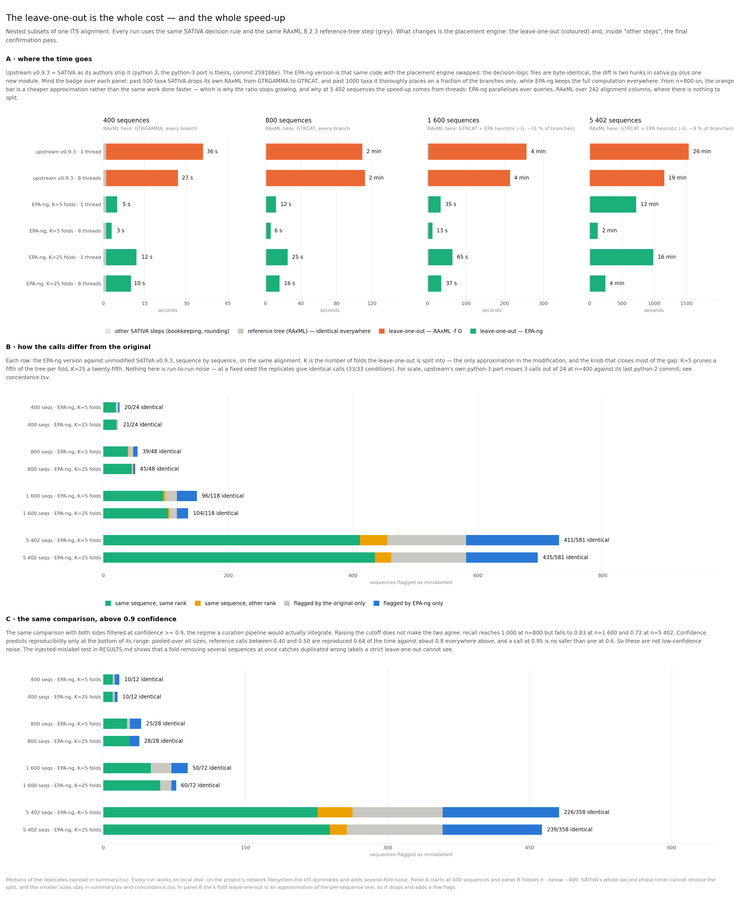

# SATIVA with EPA-ng: speed, agreement, and where the differences come from

Context. I am cleaning a large reference database and applying SATIVA to it, on Daniel's
advice. The volume is such that I cluster the sequences with MMseqs2 first, with a merging
strategy that keeps enough taxonomic diversity in each alignment for SATIVA to work on.
Even so, SATIVA as released is too slow at this scale, so I had already replaced its
placement engine with EPA-ng. This report measures what that changed, in speed and in
results, and explains the differences that remain.

## What is compared

| | |
|---|---|
| Reference | `amkozlov/sativa` v0.9.3, unmodified. Python 3, leave one out by RAxML `-f O`. |
| EPA-ng version | The same code with the placement engine replaced. |
| Diff | Two hunks in `sativa.py`, one in `epac/config.py`, one new module `epac/epang_l1o.py`. `classify_util.py`, `taxonomy_util.py`, `json_util.py`, `raxml_util.py` and `msa.py` are byte identical to upstream. |
| Data | Nested random subsets (seed 42) of one clustered ITS alignment, 100 to 5402 sequences, 242 columns. |
| Host | 32 cores, 502 GB RAM. Every timed run works on local disk and alone on the machine. |

Both placement steps now run on EPA-ng: the leave one out and the final confirmation pass
(`run_epa_once`).

## Speed

Wall clock, median of the replicates.

| n | upstream, 1 thread | upstream, 8 threads | EPA-ng K=5, 1 thread | EPA-ng K=5, 8 threads | EPA-ng K=5, 16 threads |
|---|---|---|---|---|---|
| 400 | 35.9 s | 26.9 s | 5.5 s | 3.3 s | 3.3 s |
| 800 | 109.0 s | 111.6 s | 12.0 s | 5.6 s | 5.5 s |
| 1600 | 257.4 s | 214.1 s | 34.8 s | 12.7 s | 11.7 s |
| 5402 | 1536 s | 1157 s | 723 s | 129 s | 87 s |

**Threads buy RAxML little here.** At n=800, 1 thread gives 109.0 s (108.8 to 111.6 over
three replicates) and 8 threads 111.6 s (111.5 to 112.6); at n=5402, 1536 s against 1157 s,
a gain of 25 % for eight times the cores. RAxML PTHREADS splits work over alignment
columns, and 242 columns leave little to split. EPA-ng parallelises over queries and scales
close to linearly, 723 s to 87 s on 16 threads at n=5402.

**The ratio at 1 thread shrinks with size**, from 6.5x at n=400 to 2.1x at n=5402. This is
not EPA-ng slowing down, it is SATIVA switching to cheaper approximations: above 500 taxa
(`CAT_GAMMA_THRES`) its model drops from GTRGAMMA to GTRCAT, and above 1000 taxa
(`EPA_HEUR_THRES`) it enables the EPA heuristic `-G 500/n`, so only 31 % of the branches at
n=1600 and 9 % at n=5402 get a thorough insertion. EPA-ng keeps the full computation. The
badges above each panel of the figure state the regime.

**Those shortcuts cost SATIVA almost nothing in output.** Pinned to GTRGAMMA with the
heuristic off, the reference takes 397 s instead of 214 s at n=1600 and reports 119
mislabels instead of 118.

Memory: 23 to 308 MB for RAxML, 232 MB to 3.1 GB for EPA-ng. The gain is bought with RAM.

## Agreement with unmodified SATIVA

Per sequence comparison of the `.mis` files, same alignment, confidence cutoff 0.4 on both
sides.

| n | K=5 recall / precision | K=25 recall / precision |
|---|---|---|
| 200 | 0.909 / 0.625 | 1.000 / 0.917 |
| 400 | 0.833 / 0.909 | 0.875 / 1.000 |
| 800 | 0.833 / 0.851 | 0.958 / 0.939 |
| 1600 | 0.839 / 0.756 | 0.898 / 0.855 |
| 5402 | 0.783 / 0.753 | 0.793 / 0.800 |

The number of folds is the only approximation in the modification. K=5 prunes a fifth of
the tree per fold, K=25 a twenty fifth. Raising K is what closes most of the gap, and it
costs a constant factor of about 2.7 in time, which keeps a 6x to 7x advantage over RAxML
at every size (n=800: 16.4 s against 109 s; n=5402: 245 s against 1536 s).

### The scale to read those numbers against

Unmodified SATIVA compared to itself, one thing changed at a time, reference = upstream
python 3 with GTRCAT.

| n=800 | recall | precision |
|---|---|---|
| upstream, 8 threads instead of 1 | 1.000 | 0.980 |
| upstream, GTRGAMMA instead of GTRCAT | 0.917 | 0.898 |
| upstream, last python 2 commit | 0.875 | 0.857 |
| EPA-ng version, K=25 | 0.958 | 0.939 |

At n=1600 the python 2 build gives 0.814 / 0.733. Changing the placement engine moves
fewer calls than changing SATIVA's own model, and far fewer than the difference between
upstream's own python 2 and python 3 versions. Nothing here is run to run noise: at a fixed
seed the replicates produce byte identical `.mis` files, 33 conditions out of 33.

### Confidence cutoff

Same runs, both sides filtered at a stricter cutoff, K=25. Panel C of the figure shows the
0.9 case.

| cutoff | n=400 | n=800 | n=1600 | n=5402 |
|---|---|---|---|---|
| C >= 0.4 | 0.875 / 1.000 | 0.958 / 0.939 | 0.898 / 0.855 | 0.793 / 0.800 |
| C >= 0.9 | 0.833 / 0.769 | 1.000 / 0.737 | 0.833 / 0.923 | 0.718 / 0.710 |

Recall and precision, against unmodified SATIVA.

Raising the cutoff does not make the two versions converge. It helps where the two already
mostly agree (recall reaches 1.000 at n=800, precision 0.923 at n=1600) and not at 5402.

Confidence is a poor predictor of reproducibility, except at the very bottom. Reference
calls pooled over all sizes, and how often the EPA-ng version reproduces them at the same
rank:

| reference confidence | calls | reproduced, K=5 | reproduced, K=25 |
|---|---|---|---|
| 0.40 to 0.50 | 39 | 0.49 | 0.64 |
| 0.50 to 0.70 | 121 | 0.81 | 0.79 |
| 0.70 to 0.90 | 146 | 0.78 | 0.86 |
| 0.90 to 1.00 | 482 | 0.73 | 0.78 |

Only the 0.40 to 0.50 band stands out, and it is 39 calls out of 788. Above 0.5 the rate is
flat: a call at 0.95 is no more likely to be reproduced than a call at 0.6. So the
disagreements are not low confidence noise that a stricter cutoff would remove.

## Injected mislabels: where the k-fold wins

Daniel Lundin's observation on GTDB is that SATIVA fails to flag a handful of *S. aureus*
sequences assigned to *E. coli*, and his explanation is that the leave one out removes one
sequence at a time, so the remaining copies of the same wrong label anchor the placement.

Test with ground truth: relabel *k* sequences of one species with the name of a distant
genus, then count how many each method flags. Three donor clades, k in {1, 2, 3, 5}, 33
injected sequences, n=400.

| donor clade to wrong label | k=1 | k=2 | k=3 | k=5 |
|---|---|---|---|---|
| *Aspergillus* to *Bipolaris* | 1/1, 1/1 | 2/2, 2/2 | **1/3**, 3/3 | 5/5, 5/5 |
| *Russula alutacea* to *Aspergillus* | 1/1, 1/1 | 2/2, 2/2 | 3/3, 3/3 | 5/5, 5/5 |
| *Russula azurea* to *Bipolaris* | 1/1, 1/1 | **0/2**, 2/2 | 3/3, 3/3 | **4/5**, 5/5 |

Each cell: unmodified SATIVA, then the EPA-ng version. K=5 and K=25 score the same.

Unmodified SATIVA finds 28 of 33. The EPA-ng version finds 33 of 33. Every miss happens when at least two
sequences share the wrong label. This is the failure mode Daniel describes, reproduced, and
the k-fold is not subject to it because a fold removes several sequences at once.

Consistent with this, of the 7 sequences K=5 flags at n=800 that the reference does not, 6
belong to species with 2 to 5 members in the dataset.

Limits: one alignment, three clades, one replicate per scenario, injections at order or
phylum distance. This demonstrates the failure mode exists and that the k-fold avoids it.
It does not measure a detection rate.

## Where the residual differences come from

Three candidates were tested. Two are dead, one is real but small.

**Not the edge remapping.** Translating EPA-ng edge numbers back to SATIVA's `B=` numbering
loses 0 to 0.2 % of the likelihood weight over five folds.

**Not the model switch.** Pinning the reference to GTRGAMMA does not bring the two engines
closer.

**An unfitted alpha, worth fixing anyway.** Above 500 taxa the `RAxML_info` file handed to
EPA-ng comes from a GTRCAT run, where `alpha: 1.000000` is a placeholder, since CAT fits no
gamma shape. EPA-ng takes it at face value and reports
`Rate heterogeneity: GAMMA (4 cats, mean), alpha: 1 (user)`. The fitted value on this
alignment is 1.642. Building the reference tree under GTRGAMMA puts a real alpha in the
file. The effect is modest and mostly absorbed by raising K: recall goes from 0.833 to
0.875 at n=800 with K=5, from 0.958 to 0.979 with K=25, and is unchanged at n=1600 with
K=25. The reference tree step costs 12 s at n=5402, so the fix is close to free.

What is left sits on the decision boundary. At n=400 even the strict leave one out misses
two of the reference's 24 calls: the pair of *Bouteloua curtipendula* sequences, flagged at
species level with a proposal of `NA` and a confidence of 0.510 against a cutoff of 0.4.
Every EPA-ng setting misses them, K=5 through K=N. The third difference is a phylum
proposal where the reference itself is at 0.546.

## Recommendations

1. Set the default to **K=25**. Recall rises at every size, false positives against the
   reference disappear at n=400, and the run stays 6x to 7x faster than RAxML.
2. Build the reference tree under **GTRGAMMA** so EPA-ng receives a fitted alpha.
3. Move the **confidence cutoff** from 0.4 to 0.5, and no further on this evidence. The
   0.40 to 0.50 band is reproduced half the time and costs 39 calls out of 788 to drop.
   Above 0.5 confidence stops predicting anything, so the 0.9 Giorgos uses on COX1 would
   discard most of the output without buying agreement.
4. Keep the leave one out approximate. Running it one sequence at a time through EPA-ng
   costs 128 s at n=400, against 36 s for RAxML on the same data, and returns the calls
   K=25 already returns. The gain of this approach comes from batching placements, so
   removing the batching removes the gain.

## How the numbers were produced

| Question | Script |
|---|---|
| Size gradient of alignments | `01_make_datasets.py` |
| One measured run of one condition | `02_bench.py` |
| Full speed matrix | `04_run_all.sh` |
| Which sequences each version flags | `05_concordance.py --details` |
| Agreement against the confidence cutoff | `06_cutoff_sensitivity.py` |
| Injected mislabels, ground truth | `07_injected_mislabels.py` |
| Figure and summary table | `03_plot.py` |

Outputs: `results/summary.tsv` (one row per condition and size), `results/concordance.tsv`
and `results/concordance_details.tsv` (per sequence agreement), `results/runs/*/run.json`
(one measured run each).

Three method points that matter. Every timed run works on local disk, because on the
project's network filesystem the I/O dominates and adds several fold noise: 200 MB written
in 14.0 s there against 0.14 s locally, and the same n=200 run measured 20.6 to 36.0 s
there against 9.7 to 9.9 s locally. Datasets use ASCII taxon names, because the 2017 python
2 SATIVA aborts on the `U+00D7` of hybrid plant names. Runs measured while sharing the
machine are recorded with `timing_trusted: false` and never enter the figure.
